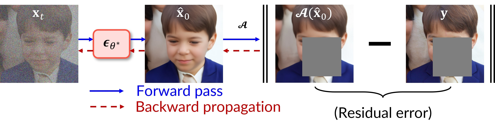
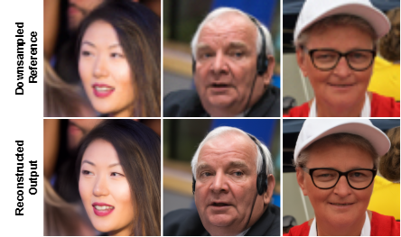
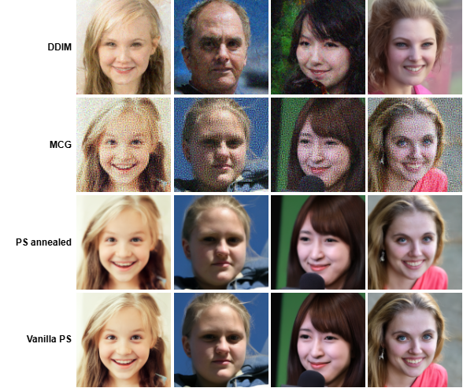

# Diffusion Posterior Sampling (DPS) for Super-Resolution

This repository implements **Diffusion Posterior Sampling (DPS)** for **single-image super-resolution (SISR)**. We use a **pretrained unconditional diffusion model** as an image prior and enforce **measurement consistency** during sampling via a likelihood-guided gradient update (Gaussian / Poisson noise), with optional projection-style constraints.

---

## DPS pipeline (forward + backward)

The figure below illustrates the core idea used in this repo: at each diffusion step, the denoiser predicts a clean estimate $$\(\hat{x}_0\)$$, we apply the forward operator $$\(\mathcal{A}(\cdot)\)$$ to compare with the measurement $$\(y\)$$, and then **backpropagate the mismatch** to guide the reverse diffusion update.



---

## Qualitative results

### Best DPS example (super-resolution)
Below is an example showing the **downsampled reference vs reconstructed output** using DPS guidance.



### Method comparison (DDIM / MCG / PS-annealed / Vanilla PS)
A qualitative comparison of multiple conditioning strategies implemented in (or compatible with) this repo.



---

## Method overview

We consider the inverse problem:
$$\[
y = \mathcal{A}(x_0) + n,
\]$$
where $$\(\mathcal{A}\)$$ is the degradation operator for SISR (e.g., downsampling), and $$\(n\)$$ is measurement noise. DPS approximates the intractable likelihood term at diffusion time $$\(t\)$$ by using a denoised estimate $$\(\hat{x}_0(x_t,t)\)$$ and applying a gradient step:
$$\[
x_t \leftarrow x_t - \rho \nabla_{x_t}\|y - \mathcal{A}(\hat{x}_0)\|_2,
\]$$
where $$\(\rho\)$$ is a guidance scale.

---

## What’s implemented

### Conditioning methods (`conditioning_method.py`)
- `vanilla`: no conditioning
- `projection`: project sample onto measurement-consistent set using `operator.project(...)`
- `ps`: **DPS / posterior sampling** via measurement-gradient guidance
- `mcg`: **gradient guidance + projection** (often more stable under strict constraints)

### Diffusion samplers (`gaussian_diffusion.py`)
- `ddpm`: stochastic reverse diffusion
- `ddim`: deterministic / low-variance sampling (faster, fewer steps often works well)

---

## Getting started 

### 1) Set environment
### [Option 1] Local environment setting

Install dependencies

```bash
conda create -n DPS python=3.8

conda activate DPS

pip install -r requirements.txt

pip install torch==1.11.0+cu113 torchvision==0.12.0+cu113 torchaudio==0.11.0 --extra-index-url https://download.pytorch.org/whl/cu113
```


### [Option 2] Build Docker image

Install docker engine, GPU driver and proper cuda before running the following commands.

Dockerfile already contains command to clone external codes. You don't have to clone them again.

--gpus=all is required to use local GPU device (Docker >= 19.03)

```bash
docker build -t dps-docker:latest .
docker run -it --rm --gpus=all dps-docker
```

### 4) Inference

```
python3 sample.py \
--data_dir=./downsized_4x \
--save_dir=./results;
```
